# Mathematical Quantification of Multi-Day Trends for a Cross-Sectional Trend Engine on

## Executive summary

### Facts

Multi-day cross-sectional trend following is best understood as a **relative-strength selection problem**: at each rebalance, you rank the full universe by a trend proxy (typically past returns across one or more horizons), go long the strongest and short the weakest, and rely on broad empirical regularities that “winners keep winning” over intermediate horizons (with important crash and regime caveats). The canonical evidence for cross-sectional momentum is the 1993 study by entity["people","Narasimhan Jegadeesh","finance professor"] and entity["people","Sheridan Titman","finance professor"], documenting significant profits to buying past winners and selling past losers in equities. citeturn3search0  A closely related literature on time-series momentum (trend following per asset) by entity["people","Tobias J. Moskowitz","finance economist"], entity["people","Yao Hua Ooi","quant researcher"], and entity["people","Lasse Heje Pedersen","finance professor"] finds trend persistence over roughly 1–12 months in diversified futures, with partial longer-horizon reversal. citeturn3search1turn3search9  In cryptocurrencies, a momentum factor is documented as a key cross-sectional driver in the widely cited “common risk factors” framework (market, size, momentum). citeturn8search0turn8search4

On Hyperliquid specifically, the public WebSocket L2 book stream is a **snapshot feed pushed on each block** (and at least 0.5s since the last push), while trades are streamed as discrete executions; candles include explicit millisecond open/close times. citeturn12view3turn12view2turn12view0  Historical data availability is explicit: Hyperliquid uploads some datasets approximately monthly to `hyperliquid-archive` (with missingness and timeliness caveats), and also exposes node-derived trade/fill archives via `hl-mainnet-node-data` (including `node_fills_by_block`). citeturn9view0  Trading costs are nontrivial for multi-day rebalances: fees are tiered by rolling 14-day volume and assessed daily in UTC, with maker rebates paid continuously; base perp rates start at 0.045% taker / 0.015% maker in the published schedule. citeturn9view3turn10view0

### Takes

For **multi-day (1–90d) horizons**, you should treat tick/ms/second granularity primarily as (i) a way to construct **clean daily/hourly features** without exchange-candle quirks, and (ii) a way to build a **liquidity-and-cost model** (spreads, depth, market impact, fill quality). Your core predictors will almost always be **volatility-normalised returns across multiple horizons**, optionally enriched by regression slope/t-stat and moving-average variants as redundant-but-stabilising features. The order book and order flow are most valuable as **cost-aware conditioners** (“trade less / scale down when liquidity is poor or impact is high”) rather than as the definition of multi-day trend itself—because order-flow imbalance is strongest at short horizons and decays, even when statistically linked to price changes at high frequency. citeturn3search15turn3search1

The deciding factor for deployment is usually not whether you can produce a trend signal—your universe almost certainly will—but whether the signal survives (a) realistic costs and impact, (b) data-snooping controls, and (c) regime stress (crash periods, funding/liquidation cascades). Use selection-bias-aware statistics like the Deflated Sharpe Ratio and data-snooping-aware tests like White’s Reality Check as “default gatekeepers” for any large signal library. citeturn4search1turn4search2

## Data foundations and microstructure constraints on Hyperliquid

### Evidence

Hyperliquid provides real-time market data over WebSocket (mainnet `wss://api.hyperliquid.xyz/ws`) and a REST-style “info” endpoint; its WebSocket subscription schemas define `WsTrade` (trade executions) and `WsBook` (L2 order book snapshots). citeturn15search6turn12view2turn12view3  The schema definition for `WsBook` explicitly notes it is a **snapshot feed** pushed on each block that is at least 0.5 seconds since the last push; this implies that public L2 book observations are fundamentally **block-synchronised snapshots** rather than a full tick-by-tick diff stream. citeturn12view3  Candles are available in intervals ranging from 1m up to 1M, and candle fields explicitly label open/close times as milliseconds (`t` / `T`). citeturn9view1turn12view0

For deeper depth and/or diffs, the open-source `order_book_server` project (explicitly “not written by the Hyperliquid Labs core team”) extends `l2Book` with an optional `n_levels` (defaults to 20, up to 100) and introduces an `l4book` feed that sends a full snapshot then forwards order diffs by block; it also warns that batching by block makes it a few milliseconds slower than a streaming implementation and that it may be incomplete/incompatible. citeturn9view2  Hyperliquid’s own latency guidance recommends constructing the book locally using node outputs, explicitly stating node outputs are faster and more granular than the API, and points to the same order book server as an example path. citeturn11view1

On historical data, Hyperliquid documents two key archival buckets: (i) `hyperliquid-archive` (uploaded approximately monthly, may be missing, L2 snapshots in `market_data` and asset contexts in `asset_ctxs`, distributed as `.lz4` files under a date/hour path), and (ii) node-derived archives under `hl-mainnet-node-data`, including `node_fills_by_block` streamed from a non-validating node with `--write-fills --batch-by-block`, plus older `node_fills` and `node_trades`. citeturn9view0

A high-quality local dataset will typically include both **exchange timestamps** (the `time` fields from feeds) and **local receipt timestamps**; some vendors’ historical replay formats explicitly add local timestamps to the raw exchange messages, illustrating the operationally important distinction between “exchange event time” and “when you learned about it.” citeturn18view0turn12view2

Finally, order and sizing constraints matter for microstructure and execution: Hyperliquid enforces price precision (≤5 significant figures and ≤`MAX_DECIMALS - szDecimals` decimals, where `MAX_DECIMALS` is 6 perps / 8 spot) and size rounding to `szDecimals` retrieved from metadata; violations are rejected. citeturn11view0

### Takes

For multi-day trend signals, the **most dangerous data error** is not missing a millisecond—it is building inconsistent “daily” observations (wrong timezone boundary, stale mid fallback, irregular sampling) and then attributing artefacts to trend. Hyperliquid’s fee tier assessment is daily in UTC, so aligning your daily accounting boundary to UTC is operationally coherent even if your research view uses other time zones. citeturn9view3  The `allMids` response notes a specific fallback: if the book is empty, last trade is used; in thin markets this can produce misleading “mids” unless you explicitly tag empty-book states. citeturn13view0

Because the public L2 stream is snapshot-per-block (not full diffs), high-frequency order-flow features will be **coarsened** unless you reconstruct diffs from node outputs or use an L4-by-block diff stream. That’s acceptable for multi-day trends if you treat order book signals as **liquidity/impact estimators** rather than “the trend.” citeturn12view3turn11view1turn9view2

## Mathematical definitions of multi-day trend and conditioning signals

### Evidence base for multi-day trend in cross-sections

Cross-sectional momentum is historically robust in equities, and time-series momentum/trend works across major futures, with 1–12 month persistence being a key empirical regularity. citeturn3search0turn3search1  In crypto cross-sections, momentum is documented as one of the principal factors explaining expected returns in large-universe studies; more recent crypto-specific work continues to propose and validate trend-style predictors (often aggregating information across horizons and sometimes including volume features). citeturn8search0turn8search22  Crypto-specific momentum dynamics are also reported to be frequency- and regime-sensitive in empirical work spanning minutes to months, reinforcing the need for sampling-robustness checks. citeturn8search2

### Price, return, and horizon notation

Let \(p_{i,t}\) be a reference price for asset \(i\) at time \(t\). For multi-day signals you typically work with one of:

- **Mid price**: \(m_{i,t} = \frac{a_{i,t} + b_{i,t}}{2}\) from best ask/bid snapshots. citeturn12view3turn12view0  
- **Last trade**: \(p^{last}_{i,t}\) from trades (`WsTrade`). citeturn12view2  
- **Daily VWAP**: \(VWAP_{i,d} = \frac{\sum_{j \in d} p_{i,j} q_{i,j}}{\sum_{j \in d} q_{i,j}}\) using trade prints. citeturn7search8turn12view2  

Define log returns over horizon \(\Delta\):
\[
r_{i,t}(\Delta) = \ln\!\Big(\frac{p_{i,t}}{p_{i,t-\Delta}}\Big).
\]

For crypto (24/7), you must define a “day” boundary. Using UTC is often operationally consistent with fee-tier accounting (assessed end-of-day UTC). citeturn9view3turn13view0

### Core multi-day trend metrics and parameterisation

The most reliable multi-day trend signals in practice are usually **multi-horizon returns** combined with **volatility scaling**, optionally regularised by regression-based measures.

#### Multi-horizon return ensemble (15m → 14d; emphasise 1d–90d)

Choose horizons \(\Delta \in \{\Delta_1,\dots,\Delta_K\}\), e.g.:

- intraday anchors: 15m, 1h, 4h, 12h  
- multi-day core: 1d, 3d, 7d, 14d, 30d, 60d, 90d

Construct a weighted sum:
\[
S^{ret}_{i,t} = \sum_{k=1}^{K} w_k \, r_{i,t}(\Delta_k),
\]
with \(w_k\) either hand-set (e.g., equal weights, or more weight to 7–30d) or estimated in a nested CV loop (see validation section). citeturn3search2turn4search2

**Volatility adjustment (recommended):**
\[
\tilde{S}^{ret}_{i,t} = \frac{S^{ret}_{i,t}}{\hat{\sigma}_{i,t}},
\quad 
\hat{\sigma}_{i,t} = \sqrt{\sum_{u=t-W+1}^t r_{i,u}^2}
\]
(or a robust alternative). Volatility-managed scaling has strong empirical backing in broader asset-pricing contexts and is often stabilising for momentum/trend portfolios. citeturn6search0

#### Moving averages (SMA / EMA / Hull)

For a sampling interval (e.g., hourly or daily bars), define:

- **SMA**:
\[
SMA_{i,t}(n)=\frac{1}{n}\sum_{j=0}^{n-1}p_{i,t-j}
\]
- **EMA** (span \(n\), smoothing \(\alpha = 2/(n+1)\)):
\[
EMA_{i,t}(n)=\alpha p_{i,t}+(1-\alpha)EMA_{i,t-1}(n)
\]

Trend direction often uses crossovers:
\[
S^{ma}_{i,t} = \mathrm{sign}\big(MA_{i,t}(n_f)-MA_{i,t}(n_s)\big).
\]

- **Hull Moving Average (HMA)** (a low-lag MA variant introduced by entity["people","Alan Hull","technical analyst"]): commonly written as
\[
HMA(n) = WMA\!\left(\sqrt{n}\right)\Big(2\cdot WMA(n/2) - WMA(n)\Big),
\]
where \(WMA\) is the weighted moving average. citeturn17search3turn17search0

Typical multi-day parameter ranges:
- daily bars: \(n \in [10, 200]\), crossovers like (20,80), (50,200)  
- hourly bars: scale by ~24 (but validate; crypto intraday seasonality is real)

**Trade-off:** MA rules can reduce noise but increase lag and often add turnover unless treated as filters rather than primary alpha. citeturn3search0turn3search1

#### Momentum as rate-of-change (ROC)

The ROC over horizon \(\Delta\) is:
\[
ROC_{i,t}(\Delta) = \frac{p_{i,t} - p_{i,t-\Delta}}{p_{i,t-\Delta}}
\]
(or equivalently \(e^{r_{i,t}(\Delta)}-1\)). For cross-sectional ranking, log-return versions are typically more stable under scaling. citeturn3search0turn8search0

#### Regression slope and t-statistic of trend

Fit a linear model on log prices:
\[
\ln p_{i,t-j} = \alpha + \beta j + \varepsilon_j,\quad j=0,\dots,W-1.
\]
Use slope \(\hat{\beta}\) as trend speed and \(t_\beta=\hat{\beta}/SE(\hat{\beta})\) as a scale-free trend-strength proxy. This behaves like a “signal-to-noise” estimator and is often more comparable across assets than raw slope.

Typical ranges:
- \(W\in[7, 120]\) days (or equivalent in hours)

Trade-off:
- regression metrics can outperform single-horizon returns in noisy assets but can be unstable in thin markets if your reference price is contaminated by last-trade fallback or sparse prints. citeturn13view0turn8search2

#### ADX as trend strength (directionless)

The Average Directional Index (ADX), introduced by entity["people","J. Welles Wilder","technical analyst"], is computed from true range (TR), directional movements (\(+DM\), \(-DM\)), directional indicators (\(+DI\), \(-DI\)), then smoothed into ADX:
\[
ADX_t = \mathrm{smooth}\left(100 \cdot \frac{|+DI_t - -DI_t|}{+DI_t + -DI_t}\right).
\]
It measures trend strength regardless of direction. citeturn6search15turn17search2

Typical ranges:
- classic: 14 periods (use “14 days” on daily bars; scale with bar frequency)

Trade-off:
- ADX can be useful as a regime filter (trend vs chop) but is sensitive to how you construct OHLC bars in 24/7 markets. citeturn9view1turn12view0

#### VWAP deviations and multi-day “flow-trend” hybrids

To incorporate volume information across days:
\[
VWAP_{i,t}(W)=\frac{\sum_{u=t-W+1}^t \sum_{j\in u} p_{i,j} q_{i,j}}{\sum_{u=t-W+1}^t \sum_{j\in u} q_{i,j}},
\qquad
Z^{vwap}_{i,t}=\frac{p_{i,t}-VWAP_{i,t}(W)}{\hat{\sigma}_{i,t}}
\]
where the inner sum is over trades in day \(u\).

Trade-off:
- VWAP deviation can behave like a mean-reversion signal intraday, but over multi-day windows it can capture persistent pressure if trending markets trade “above their volume-weighted mean”. VWAP is also a key benchmark in execution research, so even if not an alpha driver it is valuable in cost evaluation. citeturn7search1turn7search8turn12view2

#### Order-flow imbalance and book-based conditioning (microstructure-informed)

Order-flow imbalance (OFI) is empirically linked to short-horizon price changes via an approximately linear relation, with slope inversely related to depth (a key result in limit-order-book microstructure). citeturn3search15turn3search23  Even for multi-day engines, you can use flow and book features as **tradeability/pricing filters** and to estimate impact.

Practical definitions you can compute from Hyperliquid data:

- **Signed volume imbalance over a day**:
\[
SVI_{i,d}=\sum_{j\in d} s_{i,j} q_{i,j},\quad s_{i,j}\in\{+1,-1\}
\]
with \(s\) derived from `WsTrade.side`. Normalise:
\[
NVI_{i,d} = \frac{SVI_{i,d}}{\sum_{j\in d} q_{i,j}}
\]
to get a \([-1,1]\)-like pressure score. citeturn12view2

- **Spread statistics** (cost proxy):
\[
spread_{i,t}=a_{i,t}-b_{i,t},\quad relSpread_{i,t}=\frac{a_{i,t}-b_{i,t}}{m_{i,t}}
\]
then aggregate (median, 95th percentile) over the day. citeturn12view3turn12view0

- **Depth within \(k\) bps** (impact proxy): sum sizes within a price band around mid, using L2 levels. The default public-like depth is 20 levels; up to 100 levels and L4 diffs are available via the order book server approach. citeturn9view2turn12view3

- **Depth-weighted execution price for notional \(Q\)** (expected slippage): for asks \((p_\ell, q_\ell)\),
\[
VWAP^{ask}(Q)=\frac{1}{Q}\sum_{\ell} p_\ell \cdot \min\{q_\ell,\, Q-\sum_{k<\ell}q_k\}_+,
\]
and similarly for bids.

- **Micro-price (short-horizon fair-price estimator)**: define best-bid/ask imbalance \(I_t=\frac{Q^b_t}{Q^b_t+Q^a_t}\) and spread \(S_t\). The micro-price can be expressed as a mid-price adjustment that depends on spread and imbalance; a Markovian construction is presented in work by entity["people","Sasha Stoikov","quant researcher"] (useful as a reference-price improvement to reduce bid–ask bounce in very high-frequency measurement). citeturn6search14

### Normalisation (robust + cross-sectional)

For cross-sectional engines, comparability is everything. A standard robust pipeline:

1) **Robust time-series scaling per asset** (rolling median/MAD):
\[
z^{ts}_{i,t}=\frac{x_{i,t}-\mathrm{median}(x_{i,t-W:t})}{1.4826\cdot \mathrm{MAD}(x_{i,t-W:t})}.
\]

2) **Cross-sectional rank normalisation** at time \(t\):
\[
z^{cs}_{i,t}=\Phi^{-1}\!\left(\frac{\mathrm{rank}(z^{ts}_{i,t})}{N+1}\right).
\]

3) **Cost-aware score**:
\[
score^{net}_{i,t}=z^{cs}_{i,t}-\lambda\cdot \widehat{Cost}_{i,t}
\]
with \(\widehat{Cost}\) built from fee, spread, and impact estimates (next section). This directly addresses the “looks good before costs” failure mode that is common in high-turnover crypto strategies. citeturn9view3turn10view0turn4search0

### Comparative signal table

The table below is oriented to **multi-day (1–90d) trend selection**, with microstructure features treated as *conditioning/cost* variables unless otherwise noted.

| Signal | Formula (LaTeX) | Data needed | Typical parameter ranges | Frequency suitability | Strengths | Failure modes | Expected cost sensitivity |
|---|---|---|---|---|---|---|---|
| Multi-horizon returns | \(S=\sum_k w_k r(\Delta_k)\) | price series | \(\Delta\in\) 1d–90d (plus 15m–12h anchors) | daily/weekly | strong baseline; interpretable; easy ranking | crowding + crash risk; horizon instability across regimes | medium (via turnover) |
| Vol-scaled momentum | \(\tilde S = S/\hat\sigma\) | returns | \(\hat\sigma\): 7d–60d | daily/weekly | stabilises exposure; reduces tail risk | vol estimate bias if sampling inconsistent | medium |
| SMA crossover | \(\mathrm{sign}(SMA(n_f)-SMA(n_s))\) | price | (10,50), (20,80), (50,200) days | daily | noise reduction; simple regime filter | lag; can increase turnover around chop | medium |
| EMA crossover | \(\mathrm{sign}(EMA(n_f)-EMA(n_s))\) | price | spans like SMA (EMA is faster) | daily | less lag than SMA | still laggy; parameter sensitivity | medium |
| Hull MA slope | \(\Delta HMA(n)\) | price | \(n\in[10,100]\) days | daily | lower lag; responsive in trends | higher turnover; more whipsaws | high |
| ROC | \(\frac{p_t-p_{t-\Delta}}{p_{t-\Delta}}\) | price | \(\Delta\in[1,90]\) days | daily/weekly | intuitive; scale-friendly | unstable in extreme vols; overlaps with returns | medium |
| Regression t-stat | \(t_\beta\) from \(\ln p\sim \alpha+\beta t\) | price | window \(W\in[7,120]\) days | daily/weekly | “signal-to-noise” measure; comparable cross-section | unstable with sparse/dirty prices | medium |
| ADX | see definition | OHLC bars | 14 (scaled) | daily | trend-strength filter | bar construction sensitivity; false trend in gaps | low–medium |
| VWAP deviation | \((p-VWAP)/\hat\sigma\) | trades (px, sz) | VWAP window 1d–14d | daily | includes volume; doubles as execution benchmark | may flip to mean reversion behaviour in range-bound markets | medium |
| Signed volume imbalance | \(SVI=\sum s_j q_j\) | trades with side | 1d aggregation; 3d–14d smoothing | daily | captures persistent “pressure” | side classification errors; fades with latency | low–medium |
| Spread filter | \(relSpread=(a-b)/m\) | L2 top levels | thresholds by quantile | intraday→daily gating | cheap tradeability proxy | snapshots can miss within-block spikes | reduces costs |
| Depth/impact proxy | \(VWAP^{ask}(Q)-m\) | L2 depth (20–100 levels) | \(Q\): target trade sizes | rebalance-time | direct slippage estimator | L2 truncation; replenishment ignored | critical |
| OFI (conditioning) | OFI over intervals | L2 diffs/L4 + trades | seconds→hours; daily aggregate | mostly gating | microstructure realism; detects toxic periods | needs diff-quality data; decays at multi-day | reduces adverse selection |

## Illustration: moving averages on a multi-day path (synthetic)

The figure below is **illustrative only** (synthetic data) and is included to show how MA families differ in lag and smoothness when applied to multi-day horizons.

citeturn17search3turn6search15turn3search0

## Execution, fees, slippage, and market impact for multi-day horizons

### Evidence

Hyperliquid fees are based on rolling 14-day volume and assessed daily in UTC; maker rebates are paid continuously, and spot volume counts double toward fee tier determination. citeturn9view3turn10view0  The fee schedule shows base perp taker/maker rates of 0.045% / 0.015% (with further tier schedules). citeturn10view0  On the data side, user fill records include a `crossed` boolean (taker vs maker) and a `fee` field where negative means rebate—this matters for correct backtest accounting. citeturn12view0

For execution algorithms, Hyperliquid supports a TWAP order type: it divides a large order into suborders executed at 30-second intervals; suborders have max slippage of 3%; and the TWAP attempts to catch up if execution falls behind (subject to constraints). citeturn16view0  The exchange endpoint documents TWAP order placement fields (minutes, randomise, reduceOnly) and uses a nonce recommended to be the current timestamp in milliseconds. citeturn15search2

In market microstructure, the optimal execution framework of entity["people","Robert Almgren","optimal execution"] and entity["people","Neil Chriss","trading researcher"] models trading cost as a combination of (temporary and permanent) market impact and price risk, producing an efficient frontier of schedules. citeturn4search0  Implementation shortfall (a standard execution objective) was introduced by entity["people","André F. Perold","harvard finance"] as the performance difference between a “paper” decision-price portfolio and the realised executed portfolio. citeturn7search3turn7search7  VWAP and related benchmarks are widely studied in optimal execution research (including mean–variance formulations). citeturn7search1turn7search8  The Bank for International Settlements (BIS) describes percentage-of-volume (POV) execution as targeting a participation rate in market volume. citeturn7search0

### Takes

Multi-day strategies often trade less frequently than intraday alphas, but they typically trade **larger notional per rebalance** (and across many markets), so an “impact-first” viewpoint is sensible: **the dominant costs are usually spread + impact**, with fees being predictable but not negligible (especially when taking liquidity). The correct approach is to make expected cost an explicit term in the portfolio objective, not a post-hoc haircut.

A robust (and implementable) expected-cost model at rebalance time \(t\) for asset \(i\) is:

\[
\widehat{Cost}_{i,t}(Q) = \underbrace{fee_{i,t}}_{\text{maker/taker tier}} + \underbrace{\frac{relSpread_{i,t}}{2}}_{\text{crossing}} + \underbrace{Impact_{i,t}(Q)}_{\text{depth/AC model}} + \underbrace{Slip_{i,t}(\text{latency})}_{\text{arrival-to-fill}},
\]
and you plug \(\widehat{Cost}\) into score or optimiser constraints.

#### Fees

Model fees using the published tier schedule (UTC daily assessment) and apply maker/taker based on whether the order crosses; in fill-ledger backtests, use the signed fee conventions (`fee` negative = rebate). citeturn9view3turn10view0turn12view0

#### Slippage from L2 depth (empirical, venue-specific)

Given L2 asks/bids, compute the expected execution VWAP for your target order size \(Q\) using the depth-weighted formula defined earlier, then define expected slippage as:
\[
slip^{mkt}_{i,t}(Q)=\frac{VWAP^{ask}(Q)-m_{i,t}}{m_{i,t}}
\]
(for buys; use bids for sells). This turns “depth/levels” into a measurable tradeability constraint; it is especially important because public-style depth may be limited (default ~20 levels), whereas deeper books require 100-level feeds or L4 reconstruction. citeturn9view2turn12view3

#### Market impact: Almgren–Chriss vs depth-based

- **Almgren–Chriss** (schedule optimisation): model temporary impact as proportional to trading rate and permanent impact proportional to total size; choose schedule trading off impact vs price risk. citeturn4search0  
- **Depth-based empirical impact** (common in practice): calibrate impact as a function of consumed depth/relative volume using your own fills, with L2/L4 snapshots providing state variables.

Even if you do not explicitly solve the AC control problem, its conceptual separation of **risk term** and **impact term** is a valuable design pattern for multi-day rebalances. citeturn4search0

#### Execution styles aligned to multi-day trend rebalances

- **Maker-first with timeout** (cost-minimising): place post-only orders near best bid/ask with a time budget; if not filled, cross (become taker). This exploits maker rebates but risks adverse selection; microstructure conditioning (spread, depth deterioration) helps decide when not to insist on maker. citeturn12view0turn10view0turn3search15  
- **TWAP** (impact control): for larger rebalances, use Hyperliquid’s TWAP order type (30s slices, 3% slippage cap) to distribute impact. citeturn16view0turn15search2  
- **POV** (liquidity-following): target a participation rate \(\pi\) of observed market volume, which tends to reduce footprint in low-volume regimes; POV is conceptually standard in execution literature and described by BIS. citeturn7search0  
- **VWAP tracking** (benchmark-driven): execute to minimise deviation from VWAP; studied in formal optimal execution settings. citeturn7search1turn7search8

## Backtest design and evaluation for multi-day cross-sectional trends

### Portfolio construction (cross-sectional engine)

At each rebalance time \(t\), given normalised cross-sectional scores \(z^{cs}_{i,t}\):

1) **Selection**: long top \(q\%\), short bottom \(q\%\).  
2) **Weighting**: equal-weight within buckets or risk-weight:
\[
w_{i,t} \propto \frac{z^{cs}_{i,t}}{\hat{\sigma}_{i,t}},
\]
consistent with volatility-managed logic. citeturn6search0  
3) **Constraints** (recommended):
- net exposure \(\sum_i w_{i,t}\approx 0\) (if long/short)  
- caps: \(|w_{i,t}|\le w_{\max}\)  
- liquidity caps: ensure \(Q_{i,t}\) is small relative to depth/volume  
- turnover penalty: minimise \(\sum_i |w_{i,t}-w_{i,t-1}|\) because costs scale with turnover in fee+impact settings. citeturn9view3turn4search0turn7search3

### Rebalance cadence (multi-day focus)

Common baselines to evaluate:
- daily rebalance (UTC boundary) with 1–2h execution window  
- 2–3x weekly rebalance  
- weekly rebalance

Your optimal cadence is usually a trade-off: faster rebalance increases signal reactivity but also turnover and impact. This is precisely why you need parameter heatmaps and cost-aware optimisation rather than a single “best” window. citeturn10view0turn4search0

### Evaluation metrics (definitions and why they matter)

Let \(R_t\) be strategy return per period and \(R_f\) risk-free (for crypto you often set \(R_f\approx 0\) over short horizons; if you include a funding/cash yield, define explicitly).

- **Sharpe ratio**:
\[
SR = \frac{\mathbb{E}[R_t - R_f]}{\sqrt{\mathrm{Var}(R_t - R_f)}}.
\]
The Sharpe ratio originates in the mutual fund performance work of entity["people","William F. Sharpe","nobel economist"]. citeturn14search2

- **Sortino ratio** (downside-risk focus; introduced by entity["people","Frank A. Sortino","portfolio theorist"] and entity["people","R. A. van der Meer","finance researcher"]):
\[
Sortino = \frac{\mathbb{E}[R_t - T]}{\sqrt{\mathbb{E}[\min(R_t - T, 0)^2]}}
\]
with target \(T\) (often 0). citeturn14search4turn14search0

- **Calmar ratio** (drawdown-adjusted performance):
\[
Calmar = \frac{\text{annualised return}}{\text{max drawdown}}
\]
(commonly discussed among popular performance ratios). citeturn14search5

- **Hit rate**: \(\Pr(R_t>0)\) (useful but can be misleading with skewed payoff).  
- **Max drawdown (MDD)**: maximum peak-to-trough decline of equity curve.  
- **Turnover**: \(\sum_i |w_{i,t}-w_{i,t-1}|\) (proxy for cost pressure).  
- **Deflated Sharpe Ratio (DSR)**: a selection-bias-aware Sharpe adjustment developed by entity["people","David H. Bailey","mathematician, quant"] (with co-authorship by López de Prado), correcting for multiple testing and non-normality; use as a default when you search many parameters/signals. citeturn4search1turn4search33

### Illustrative charts (synthetic data) for methodology

The following figures are **synthetic** and included only to show the *types of diagnostics* you should produce on your Hyperliquid dataset.

These are the basic visual checks you want on real data: net vs gross divergence (cost sensitivity), and smoothness/robustness across parameter neighbourhoods (avoid knife-edge tuning). citeturn4search1turn4search2

### Signal generation flow (multi-day cross-sectional engine)

```mermaid
flowchart LR
  A[Inputs: trades, L2/L4 book, asset ctx, fees] --> B[QC: align time, dedup, precision rules]
  B --> C[Bars: 1m/5m/1h + daily UTC]
  C --> D[Features: returns 1d-90d, MA, slope/t, ADX, VWAP dev, flow imbalance]
  D --> E[Normalise: robust z per asset -> cross-sectional rank]
  E --> F[Cost model: tier fee + spread + depth impact + latency]
  F --> G[Net score = alpha proxy - lambda * expected cost]
  G --> H[Portfolio optimiser: caps, neutrality, turnover penalty]
  H --> I[Execution: maker/taker, TWAP or POV, monitoring fills]
  I --> J[Validation: walk-forward, CPCV, bootstrap, multiple-testing controls]
```

citeturn10view0turn16view0turn7search0turn3search2

## Empirical validation, multiplicity control, and robustness

### Evidence

Because financial labels overlap in time (e.g., “next 7-day return”), naive K-fold cross-validation leaks information. entity["people","Marcos López de Prado","quant researcher"] proposes purging and embargoing (and Combinatorial Purged Cross-Validation) to reduce leakage and backtest overfitting in financial ML evaluation. citeturn3search2turn3search30  For dependent time series, the stationary bootstrap of entity["people","Dimitris N. Politis","statistician"] and entity["people","Joseph P. Romano","statistician"] is a standard tool to form confidence intervals under weak dependence. citeturn4search3turn4search7  White’s Reality Check addresses data snooping by testing whether the best-performing rule among many is truly superior to a benchmark, using bootstrap methods. citeturn4search2

Multiple hypothesis correction methods include familywise error controls like the sequential step-down method of entity["people","Sture Holm","statistician"] and false discovery rate control as in entity["people","Yoav Benjamini","statistician"] and entity["people","Yosef Hochberg","statistician"]; Bonferroni-type adjustments are widely used but conservative. citeturn5search0turn5search1turn5search30

Finally, sampling frequency matters: volatility estimation can be biased by microstructure noise at very high frequency; two-scale realised volatility methods address this issue in noisy high-frequency data. citeturn6search1turn6search13

### Takes

A multi-day cross-sectional engine should run validation as a *pipeline*, not as an afterthought:

1) **Walk-forward outer loop**: train on history, test on the next segment, roll forward; report distribution of out-of-sample results, not a single run. citeturn3search2  
2) **Nested CV for parameter selection**: inner loop chooses horizons/weights/thresholds; outer loop reports unbiased performance.  
3) **Purged K-fold + embargo (or CPCV)**: essential when labels overlap; otherwise you will overstate performance, especially for multi-horizon blends. citeturn3search2turn3search30  
4) **Bootstrap**: use stationary/bootstrap blocks for confidence intervals and to stress dependence. citeturn4search3  
5) **Multiplicity control**: if you search \(M\) signals × \(P\) parameter settings × \(U\) universes, you must either (a) correct p-values (Holm/BH), (b) use Reality Check / DSR gates, or ideally (c) do all of these. citeturn4search2turn4search1turn5search0turn5search1  
6) **Robustness to sampling**: re-run the same signal definitions using bars at 1m, 5m, 1h, daily, and (where feasible) block-time snapshots; signals that only “work” at a single sampling are often microstructure artefacts. citeturn12view3turn6search1

Regime analysis should at minimum stratify by:
- **volatility regime** (quantiles of realised volatility or robust variants), because vol-managed scaling and momentum crash risk are regime dependent. citeturn6search0turn8search33  
- **liquidity regime** (spread/depth), because both execution quality and the informativeness of flow signals vary with depth, consistent with OFI depth-scaling evidence. citeturn3search15turn12view3turn9view2

## Recommended datasets, primary sources, and what would change the deployment decision

### Recommended datasets and primary sources (prioritised)

**Highest trust: Hyperliquid primary documentation and archives**
- WebSocket endpoints and schemas (`WsTrade`, `WsBook`, candle intervals, `WsFill` with `crossed` and signed fee semantics). citeturn15search6turn12view2turn12view0  
- Fees schedule, tiering rules, UTC daily assessment, maker rebates. citeturn9view3turn10view0  
- Order precision rules (tick/lot constraints via significant figures and `szDecimals`). citeturn11view0  
- Historical archives: `hyperliquid-archive` (L2 snapshots / asset contexts) and node archives under `hl-mainnet-node-data` including `node_fills_by_block`. citeturn9view0  
- TWAP execution behaviour (30s slices, 3% max slippage; catch-up logic), and TWAP order placement schema via exchange endpoint. citeturn16view0turn15search2  
- Latency optimisation guidance: node output reconstruction as a more granular alternative to API. citeturn11view1  

**Deep book / diffs**
- `order_book_server` reference implementation for: 20→100 L2 levels (`n_levels`) and L4 diffs by block, with explicit caveats about non-core maintenance and block batching. citeturn9view2  

**Third-party historical/replay providers (useful, but validate)**
- entity["company","Tardis.dev","market data vendor"]: states historical data format mirrors the real-time WebSocket messages with the addition of local timestamps; useful for replay-style backtesting and latency modelling. citeturn18view0  
- entity["company","Dwellir","infra and data provider"]: documents archival raw products including `node_raw_book_diffs_by_block`, and offers OHLCV and tick products with stated millisecond timestamps and block sequencing; treat stated “completeness” claims as hypotheses to verify against samples and on-chain state. citeturn19view0  

### Source incentives and credibility notes

Hyperliquid’s own docs have the strongest incentive alignment for correctness of **market rules, schemas, and fee logic** (getting these wrong breaks trading and support), and they explicitly disclose limitations like S3 missingness and monthly upload cadence. citeturn9view0turn9view3turn12view3  Vendor docs are valuable for operational details (formats, coverage, replay tooling), but they are also sales funnels; claims like “no gaps” should be confirmed by independent checks (hash/block continuity, comparison with your own capture, spot-check against node archives). citeturn19view0turn18view0

### What empirical outcomes would change the decision to deploy multi-day trends

If you observe any of the following on your Hyperliquid universe backtests, the rational decision should change (either “do not deploy” or “deploy only with stricter constraints”):

1) **Net edge disappears after realistic costs**: once you apply (tiered) fees, maker/taker mix, spread crossing, and depth-based impact estimates, the strategy loses statistical and economic significance. citeturn10view0turn4search0  
2) **Edge is a sampling artefact**: performance collapses when you recompute the same signals on 1h vs daily vs block-time sampling, suggesting microstructure noise or bar-construction leakage. citeturn12view3turn6search1  
3) **Failure under data-snooping controls**: DSR falls below deployable thresholds, or White’s Reality Check no longer rejects the null once you account for the search space size. citeturn4search1turn4search2  
4) **Regime fragility**: trend works in calm regimes but suffers unrecoverable drawdowns in high-vol/liquidity-stress regimes; crypto momentum is documented to experience severe crashes in some studies, so you should treat regime-conditioned drawdown stress as mandatory. citeturn8search33turn6search0  
5) **Execution infeasibility**: your desired portfolio changes imply order sizes that routinely exceed available depth (especially if you only have 20-level L2), or your execution engine cannot meet TWAP/POV schedules without falling behind in low-liquidity periods. citeturn9view2turn16view0  
6) **Parameter knife-edge**: heatmaps show that only a tiny neighbourhood of parameters works, indicating overfitting; robust signals typically form “plateaus,” not spikes. citeturn4search2turn4search1  

If, instead, the multi-day trend effect remains positive after costs, is robust across sampling and regimes, and survives multiplicity controls, then the remaining deployment question is mostly operational: how aggressively you scale notional without worsening impact, and whether your execution layer can preserve expected costs as you grow. citeturn4search0turn7search0turn9view3