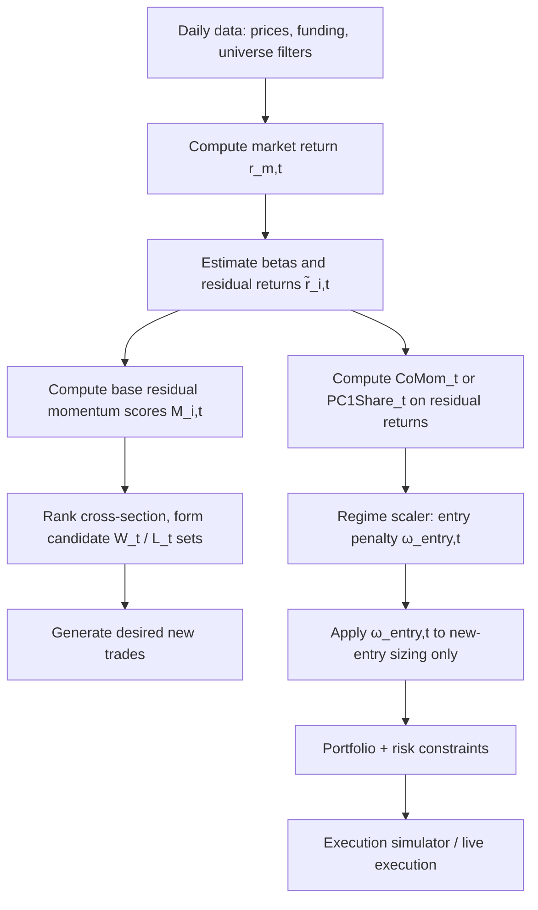

# Regime Conditioning for Daily Cross-Sectional Residual Momentum in Crypto

## Executive summary

**Facts (what the literature most strongly supports):**  
Cross-sectional momentum (buy winners, sell losers) exhibits **rare but severe crash episodes** that are **partly forecastable** in traditional assets; they tend to occur after **market declines with high volatility** and are **contemporaneous with market rebounds**. citeturn13search4turn2view1 Empirically successful mitigations in that literature are typically **state-dependent exposure controls** driven by forecasts of momentum’s conditional mean/variance or by **volatility management**. citeturn13search4turn0search2turn20view0  
In crypto specifically, multiple studies find that momentum payoffs are **highly tail-sensitive**, and that **volatility-managed/risk-managed momentum** can improve risk-adjusted performance and reduce the apparent frequency/severity of crashes (though important tail risk concerns remain). citeturn24view0turn7view3turn18view0  
For “crowding / co-movement” as a momentum hazard indicator, the most *directly implementable* (data-only) evidence is that when **abnormal return correlations among the momentum trade’s constituents** (a “comomentum” concept) are high, momentum becomes **unprofitable and crash-prone**, whereas low comomentum corresponds to profitable momentum. citeturn14view0turn14view1

**Takes (what this implies for your immediate implementation choice):**  
Given your specific failure mode—**flat or transition regimes** in a **daily residualised cross-sectional** engine with **2–5 day holds**—the single highest-probability next control is:

**Recommendation: implement a “correlation-compression / comomentum penalty” applied to *new entries only*** (not a global gross-exposure cut).  
*Why this one:* it targets the exact pathology of flat/transition regimes for cross-sectional signals—**ranks become unstable when idiosyncratic structure collapses into common-mode movement and/or the momentum book becomes internally highly correlated (“crowded”)**—and it has unusually direct evidence in the momentum crash/crowding literature. citeturn14view0turn14view1

**Ranked shortlist of your six candidates (highest → lowest probability, conditional on “one narrow control now”):**
1. **Dispersion/correlation compression gate/penalty (option 1)** — strongest direct support via comomentum-style correlation diagnostics for momentum crashes/underperformance. citeturn14view0turn14view1  
2. **Regime-dependent score penalty rather than hard gate (option 4)** — strong general and crypto-specific support for volatility/risk-managed momentum, but can look like “blunt de-grossing” if not localised to new entries. citeturn0search2turn24view0turn18view0  
3. **Momentum crash side suppression (option 6)** — particularly relevant in crypto because short legs can be structurally dangerous; good for *crash* regimes, less targeted for “flat”. citeturn13search4turn4view0  
4. **Regime-dependent portfolio concentration cap (option 5)** — sensible risk control, but thinner direct evidence as *the* best momentum crash/flat fix. citeturn16view2  
5. **Breadth disagreement gate (option 2)** — good macro diagnostic (breadth relates to returns/herding), but less directly validated as a momentum-specific crash/flat conditioner. citeturn15search0turn15search6  
6. **Leader concentration / crowded winners penalty (option 3)** — evidence is mixed because “crowding” is measurement-sensitive; some peer-reviewed work finds crowding proxies are not a stand-alone source of momentum tail risk. citeturn12view1turn12view0

**What would change the decision to deploy multi-day momentum with this control:**  
If your “flat regime slice” remains negative after costs *and* the control fails to show a **plateau neighbourhood** (stable performance around a contiguous threshold band) in walk-forward evaluation, the correct inference is that the control is either not aligned to the failure mode or the base edge is too weak under current conditions. (Details in the final section.)

## What goes wrong in flat and transition regimes for daily residual cross-sectional momentum

**Facts:**  
Momentum crashes in the canonical equity literature are linked to **state dependence**: after market declines (panic) with high volatility, **losers behave like “option-like” payoffs**, and rebounds disproportionately benefit past losers, harming a winner-minus-loser (WML) book. citeturn13search4turn2view1  
In crypto momentum studies that explicitly model implementation realism, the **short leg can be the dominant source of catastrophic outcomes**; even when restricting to large coins, short-only momentum legs can be devastating in bull markets (the exact magnitude is study-specific, but the pattern “short leg fragility” is clear). citeturn4view0turn4view1  
Short-horizon crypto momentum exists in multiple samples, but is noisy and sensitive to tails and transaction cost assumptions; volatility scaling/risk management is often tested precisely because crashes/outliers dominate inference. citeturn9view0turn18view0turn24view0

**Take (mapping to your “flat or transition regime” description):**  
For a *residualised* daily cross-sectional engine, there are two distinct practical failure modes that can look similar in live PnL but require different conditioners:

1. **Flat/structureless cross-section:** idiosyncratic dispersion collapses, residual ranks churn, turnover rises, and after-cost drift goes negative even if the raw signal is “not wrong” directionally.  
2. **Transition / momentum-crash micro-regime:** ranks may be strong but **reverse sharply** (often via losers ripping), producing clustered losses; this is where short-side controls can matter.

Your “local controls inert or harmful” is consistent with using regime indicators that are either (a) not sufficiently aligned to these mechanisms, or (b) applied as global exposure throttles that destroy the core edge in normal regimes while still not catching the specific crash/flat episodes.

## What empirical research says about forecasting momentum stress

### Predictable momentum crash states and why they matter even for crypto

**Facts:**  
The equity momentum crash literature (most prominently entity["people","Kent Daniel","finance professor"] and entity["people","Tobias J. Moskowitz","finance professor"]) documents that momentum crashes are **partly forecastable** and are associated with **panic states** (after market declines, high volatility) and **market rebounds**. citeturn13search4turn2view1  
Volatility-managed momentum à la entity["people","Pedro Barroso","finance researcher"] & entity["people","Pedro Santa-Clara","finance professor"] scales momentum exposure by a forecast of momentum’s own volatility, and the core empirical claim is that **high risk forecasts both high risk and low returns**, enabling better risk-adjusted performance than static momentum. citeturn0search2turn20view0  
A practical nuance from the crash-prediction literature is that predictor power often concentrates **in crash periods**, motivating **state-triggered gates** to avoid unnecessary continuous reweighting (and turnover) in normal regimes. citeturn20view0

**Take:**  
Even if crypto’s microstructure and participant base differ, the main transferable idea is *not* “copy equity thresholds”, but:  
- build a **momentum hazard indicator** that is (i) sparse, (ii) interpretable, and (iii) deliberately tuned to catch the rare bad states;  
- apply it in a way that preserves the base edge (e.g., **new-entry gating** or **score penalties**) rather than permanently lowering exposure.

### Crypto-specific evidence for risk management by volatility scaling

**Facts:**  
Crypto momentum research repeatedly finds that (i) **tail events dominate** momentum inference, and (ii) “risk-managed”/volatility-scaled momentum can improve risk-adjusted performance and reduce kurtosis relative to the plain momentum series (though it may not eliminate deep tail risk concerns). citeturn24view0turn7view3  
One explicit implementation in the crypto literature defines risk-managed momentum returns by scaling the plain momentum return \(r^{\text{MOM}}_t\) by a target volatility divided by an estimated rolling volatility of the momentum strategy (a Barroso–Santa-Clara style construction). citeturn18view0turn24view0

**Take:**  
This is strong support for your option (4) “regime-dependent score penalty” *if you localise it to new entries* or otherwise avoid turning it into a blunt global de-grossing rule.

### Co-movement / crowding evidence that maps directly to “flat/transition regime” gating

**Facts:**  
A particularly operational result comes from entity["people","Dong Lou","finance researcher"] & entity["people","Christopher Polk","finance researcher"]: they define **comomentum** as **abnormal return correlation** among the stocks a standard momentum strategy would hold (winners with winners; losers with losers). They show that **high comomentum** corresponds to momentum being **unprofitable and crash-prone**, while **low comomentum** corresponds to profitable and stabilising momentum. citeturn14view0turn14view1  
Separately, peer-reviewed evidence in equities ties **cross-sectional return dispersion** to time variation in value and momentum premiums; notably, dispersion is reported as negatively related to subsequent momentum premium in that setting. citeturn5view0  
Across asset classes, dispersion and correlation/crowding measures are repeatedly studied as state variables for momentum-like strategies. citeturn5view1turn14view1

**Take:**  
For your stated objective—avoid flat/transition failures without generic entry thresholds—**a correlation-compression/comomentum diagnostic is the closest thing in the literature to a “purpose-built” new-entry conditioner** that does not require microstructure alpha or open interest.

## Evidence-backed regime variables and formula classes for daily residual crypto momentum gating

Notation for your engine (daily, residualised, cross-sectional):

Let \(i \in \{1,\dots,N_t\}\) index the tradeable universe at day \(t\). Let \(r_{i,t}\) be the daily log return of instrument \(i\). Let \(r_{m,t}\) be a “crypto market” return (e.g., cap-weighted or liquidity-weighted universe return).

A typical residual return construction is:
\[
\tilde r_{i,t}=r_{i,t}-\hat\beta_{i,t}\,r_{m,t},
\]
with \(\hat\beta_{i,t}\) estimated from a rolling window regression. (Your question presumes this residualisation is already in place.)

A basic residual momentum score (formation horizon \(J\) days) is:
\[
M_{i,t}^{(J)}=\sum_{k=1}^{J}\tilde r_{i,t-k}.
\]
For 2–5 day holds, \(J\) is often short-to-medium (e.g., 5–30 trading days), but the regime-conditioning variables below are orthogonal to your exact \(J\).

### Market trend strength

**Facts:**  
Momentum crash episodes in the canonical literature are tied to market states involving prior declines and rebounds, not just “weak trend”. citeturn13search4turn20view0

**Formula class (practical):**  
Define a market trend proxy over \(L\) days:
\[
R^{(L)}_{m,t}=\sum_{k=1}^{L} r_{m,t-k},
\quad
\sigma^{(L)}_{m,t}=\sqrt{\frac{1}{L-1}\sum_{k=1}^{L}\left(r_{m,t-k}-\bar r_{m,t}^{(L)}\right)^2}.
\]
Define a rebound/panic indicator (one class used in crash-prediction work is based on **changes** in market returns/volatility): citeturn20view0  
\[
\Delta R^{(L)}_{m,t}=R^{(L)}_{m,t}-R^{(L)}_{m,t-L}.
\]

**Take:**  
This is better treated as a **crash-risk indicator** (for side suppression or strong penalties) than as your primary “flat regime” filter.

### Cross-sectional dispersion of residual returns or scores

**Facts:**  
Dispersion is a documented state variable associated with time variation in momentum-like premia (though sign and interpretation can be study- and market-dependent). citeturn5view0turn5view1  
Crypto research on herding uses dispersion measures such as CSAD to detect regimes where assets “move together” (herding), often linked to bubble-like dynamics. citeturn19view0

**Formula class:**  
Two robust daily dispersion estimators across the universe:
\[
\text{MAD}_t(\tilde r)=\operatorname{median}_i\left|\tilde r_{i,t}-\operatorname{median}_j(\tilde r_{j,t})\right|
\]
\[
\text{CSAD}_t=\frac{1}{N_t}\sum_{i=1}^{N_t}\left|\tilde r_{i,t}-\bar{\tilde r}_t\right|.
\]
You can compute analogous dispersion on scores \(M^{(J)}_{i,t}\) instead of returns.

**Take:**  
Dispersion alone is rarely sufficient as a gate because both **very low dispersion** (no opportunities) and **very high dispersion** (often transition/bubble conditions) can be problematic. Use it as part of a *compression* composite rather than a solitary threshold.

### Correlation / co-movement compression

**Facts:**  
Comomentum evidence suggests that when the constituents traded by momentum strategies exhibit high abnormal return correlation, momentum becomes unprofitable and crash-prone. citeturn14view0turn14view1

**Formula class (daily, residualised, implementable):**  
Let \(\tilde r_{i,t}\) be your residual return. Estimate a rolling covariance matrix over \(W\) days:
\[
\Sigma_t = \operatorname{Cov}\left(\tilde r_{\cdot,t-W+1},\dots,\tilde r_{\cdot,t}\right).
\]
A compact “co-movement” summary:
\[
\text{PC1Share}_t = \frac{\lambda_{1}(\Sigma_t)}{\operatorname{trace}(\Sigma_t)}.
\]
High \(\text{PC1Share}_t\) means a large fraction of residual variance is explained by the first common component.

A comomentum-style crowding proxy aligned to your trade is:
\[
\text{CoMom}_t=\tfrac12\Big(\overline{\rho}_t(W_t,W_t)+\overline{\rho}_t(L_t,L_t)\Big),
\]
where \(W_t\) and \(L_t\) are winner/loser sets (e.g., top/bottom quantiles by \(M_{i,t}^{(J)}\)), and \(\overline{\rho}_t(A,A)\) is average pairwise correlation of \(\tilde r\) inside set \(A\) over a rolling window. This mirrors the “correlation among what momentum trades” logic. citeturn14view0turn14view1

**Take:**  
This variable family is the best match to your “flat or transition regime” gating requirement because it targets *cross-sectional structure collapse* directly, rather than indirectly through market trend or volatility.

### Breadth, breadth disagreement

**Facts:**  
Market breadth is empirically linked to future returns in equities and is associated with herding/participation. citeturn15search0 Models also link breadth-return relationships to disagreement and sentiment (sign can vary with state). citeturn15search6  
However, this is not the same as a momentum-specific conditioning result.

**Formula class:**  
A minimal breadth proxy in your residual momentum context:
\[
B_t=\frac{1}{N_t}\sum_{i=1}^{N_t}\mathbf{1}\{M^{(J)}_{i,t}>0\}.
\]
A “breadth disagreement” proxy across two horizons \(J_s<J_\ell\):
\[
D_t=\frac{1}{N_t}\sum_{i=1}^{N_t}\mathbf{1}\{\operatorname{sign}(M^{(J_s)}_{i,t})\neq\operatorname{sign}(M^{(J_\ell)}_{i,t})\}.
\]

**Take:**  
Breadth/disagreement is best used as a secondary diagnostic or as a weak penalty, unless your own Hyperliquid universes show a strong, stable forward-drift separation by \(B_t\) or \(D_t\).

### Leader concentration / crowded winners

**Facts:**  
“Crowding” is not a single measurable object; conclusions depend strongly on measurement. A peer-reviewed study on crowding and momentum tail risk argues that crowding proxies built from institutional holdings do not support crowding as a stand-alone tail risk driver. citeturn12view1turn12view0  
By contrast, comomentum (return-correlation-based) evidence supports the opposite conclusion for that particular proxy. citeturn14view1turn14view0

**Formula class:**  
Define winner-set concentration by a Herfindahl index on absolute scores:
\[
w_{i,t}=\frac{|M_{i,t}^{(J)}|}{\sum_{j\in W_t}|M_{j,t}^{(J)}|},\quad
H_t=\sum_{i\in W_t} w_{i,t}^2.
\]
High \(H_t\) means the “winner signal mass” is concentrated in a few names.

**Take:**  
Because evidence is mixed and crypto lacks the institutional holdings data used in some equity studies, a leader concentration penalty is plausible but should be considered lower priority than correlation-compression.

### Volatility state

**Facts:**  
Risk-managed momentum approaches scale exposure inversely with an estimate of momentum volatility; crypto studies implement this explicitly and report reductions in higher moments (kurtosis) relative to plain momentum. citeturn24view0turn18view0

**Formula class (adapted to your daily engine):**  
Let \(f_t\) be the realised PnL return of your *paper* momentum factor (e.g., current engine’s long-short return before costs). Define:
\[
\hat\sigma_{f,t}=\sqrt{\frac{1}{L-1}\sum_{k=1}^{L}(f_{t-k}-\bar f_{t}^{(L)})^2}.
\]
A volatility-managed exposure weight:
\[
\omega_t=\operatorname{clip}\left(\frac{\sigma_{\text{target}}}{\hat\sigma_{f,t}},\ \omega_{\min},\ \omega_{\max}\right).
\]
This is the daily analogue of the crypto and equity volatility-managed constructions in the literature. citeturn24view0turn18view0

**Take:**  
To avoid “blunt de-grossing”, apply \(\omega_t\) to **new entries only** or to the **incremental notional** rather than rescaling all open risk each day.

### Funding crowding

**Facts:**  
Perpetual futures funding is designed to keep perp prices near spot; empirically, funding is paid periodically (commonly every eight hours on major venues) and is closely tied to the futures–spot premium, though exact implementations vary and can include clamps and orderbook-impact measures. citeturn23view0  
Funding rates are used in academic work as a proxy for speculative demand / expected returns in some contexts (e.g., as a proxy for speculative demand in stablecoin/leverage models). citeturn22search26turn22search18

**Formula class (cross-sectional, as a *conditioning* overlay):**  
Let \(F_{i,t}\) be the daily-summed funding paid per notional (aggregate your intraday funding intervals to a daily figure). Two regime variables:
\[
\overline{F}_t=\frac{1}{N_t}\sum_i F_{i,t},\quad
\Delta F^{W\!-\!L}_t=\operatorname{mean}_{i\in W_t}(F_{i,t})-\operatorname{mean}_{i\in L_t}(F_{i,t}).
\]

**Take:**  
Treat funding as a **reinforcement/override in extreme conditions**, not as your core flat-regime detector, because the evidence base for “funding predicts cross-sectional momentum crashes” is much thinner than for volatility and correlation/crowding.

## Recommended next implementation and validation criteria

### Comparative table of your six candidate controls

| Mechanism (your list) | Best-supported formula class | Why it should help flat/crash regimes | Gate vs penalty vs constraint | Main failure modes | Evidence strength |
|---|---|---|---|---|---|
| 1. Dispersion/correlation compression | \(\text{CoMom}_t\), \(\text{PC1Share}_t\), dispersion + correlation composites | Avoids trading when cross-sectional structure collapses (flat) or when momentum book becomes internally highly correlated (transition/crash) citeturn14view1turn19view0 | Prefer **penalty on new entries** (continuous), optionally escalates to gate in extreme tail | Can be “too off” during high-correlation-but-profitable trends; requires robust universe definition | High (direct for comomentum) citeturn14view0turn14view1 |
| 2. Breadth disagreement gate | \(D_t\) disagreement across horizons | Detects fractured regime where trends disagree; may reduce churn | Weak penalty or soft gate | Breadth effects may be market-level not momentum-specific | Medium/low citeturn15search0turn15search6 |
| 3. Leader concentration / crowd penalty | \(H_t\) (Herfindahl on winners), tail concentration | Might reduce crowding-induced reversals | Penalty or cap | “Crowding” is proxy-sensitive; can remove real edge | Mixed/low citeturn12view1turn14view1 |
| 4. Regime-dependent score penalty | \(\omega_t \propto 1/\hat\sigma_{f,t}\) or crash-state indicator | Cuts exposure when momentum risk state is bad; strong precedent in equity + crypto citeturn0search2turn24view0 | Prefer penalty; gate only in extreme crash states citeturn20view0 | Can look like blunt de-grossing if applied globally; may miss flat regimes | High citeturn24view0turn13search4turn20view0 |
| 5. Regime-dependent portfolio concentration cap | Increase tail width or cap weights when regime risky | Reduces idiosyncratic blow-ups; stabilises | Constraint | May just dilute signal; can hide rather than solve flat regime | Medium citeturn16view2 |
| 6. Side suppression (long-only / short-only in states) | Suppress shorts in rebound/panic hazard states | Targets short-leg crash mechanism (losers ripping) citeturn13search4turn4view0 | Hard rule for one side only | May lose neutrality; may underperform in downtrends | Medium/high for crash, low for flat citeturn4view0turn13search4 |

### The single narrow control to implement now

**Recommendation (one control): “New-entry Correlation-Compression Penalty”**  
Define a daily regime scalar \(C_t\) from your tradeable universe:

1) Compute residual returns \(\tilde r_{i,t}\).  
2) Define winners/losers sets \(W_t,L_t\) by your current residual momentum score \(M_{i,t}\).  
3) Compute \(\text{CoMom}_t\) (average within-set correlation) over a rolling window \(W\) (e.g., 5–20 trading days).  
4) Convert to a robust z-score against a trailing history window \(H\) (e.g., 180–365 days):
\[
z^{\text{CoMom}}_t=\frac{\text{CoMom}_t-\operatorname{median}(\text{CoMom}_{t-H:t-1})}{\operatorname{MAD}(\text{CoMom}_{t-H:t-1})+\varepsilon}.
\]
5) Map this to a **new-entry multiplier**:
\[
\omega^{\text{entry}}_t=\operatorname{clip}\left(1-\lambda\cdot \sigma\!\left(z^{\text{CoMom}}_t-\tau\right),\ 0,\ 1\right),
\]
where \(\sigma(\cdot)\) is a logistic function, \(\tau\) is a “bad-state” onset threshold, and \(\lambda\) determines penalty strength.

**Why this matches the evidence:**  
- The direction “high comomentum → momentum becomes unprofitable/crash-prone” is directly supported in the comomentum literature. citeturn14view0turn14view1  
- Applying it to **new entries only** aligns with the practical insight that much predictor power is concentrated in bad states and that binary or state-triggered designs can reduce unnecessary turnover versus constantly reweighting in normal times. citeturn20view0

**Mermaid flow for integration into your engine:**

### Threshold style and calibration (how to avoid “single winner” overfitting)

**Facts:**  
Threshold choices that act as regime switches are well known to be overfit-prone; the momentum crash prediction literature explicitly motivates state-based approaches and percentile thresholds, while also noting that predictor efficacy concentrates in crash periods. citeturn20view0

**Take (fit-for-purpose procedure for your validation plan):**  
Use your existing walk-forward framework but choose \(\tau\) and \(\lambda\) by **plateau behaviour**, not a single peak:

- Grid \(\tau\) over (say) the 60th–95th percentile of \(z^{\text{CoMom}}_t\) in each training window (coarse grid).  
- For each \(\tau\), evaluate: (i) after-cost forward edge, (ii) flat-regime slice edge, (iii) trade acceptance, (iv) turnover change.  
- Pick a **contiguous band** where results are similar (plateau), then choose the *least aggressive* point inside that band that still materially improves flat-regime and transition drawdowns.

### What empirical outcomes would change the decision to deploy

Your stated “latium fixed current winner” validation is well aligned; the key is the decision rule.

**Keep (deploy candidate control) if all hold:**
- **After-cost forward edge improves** (not just backtest).  
- **Flat market_trend slice** (your definition) improves in both mean and tail (e.g., reduced worst decile days).  
- **Trade count / acceptance** remains within an acceptable band (e.g., not collapsing to near-zero).  
- **Plateau stability**: small perturbations of \(\tau\) do not flip sign.

**Recalibrate (do not deploy yet) if:**
- Gains appear only at a razor-thin \(\tau\) point (no plateau), or only in backtest, consistent with overfitting risk highlighted in robustness discussions in crypto factor research designs. citeturn16view2turn24view0  
- Improvements come entirely from “not trading” (acceptance collapses) rather than from improving conditional drift.

**Kill (do not proceed with this mechanism) if:**
- You observe “improved backtest, worse forward” in the flat slice (your explicit failure criterion).  
- The control helps only by **reducing gross exposure broadly**, contradicting the design intent (this would suggest you implemented a de-grossing proxy rather than a flat/transition conditioner).

**Most decision-relevant falsifier:**  
If high comomentum/correlation-compression states in your Hyperliquid universe *do not* correspond to lower conditional forward returns of your momentum factor (even before costs), then the literature’s comomentum mechanism is not transporting to your setting, and you should pivot to the next-highest probability control: **volatility-/hazard-based state penalty applied only to new entries** (option 4), which has broader cross-market support. citeturn24view0turn13search4turn20view0